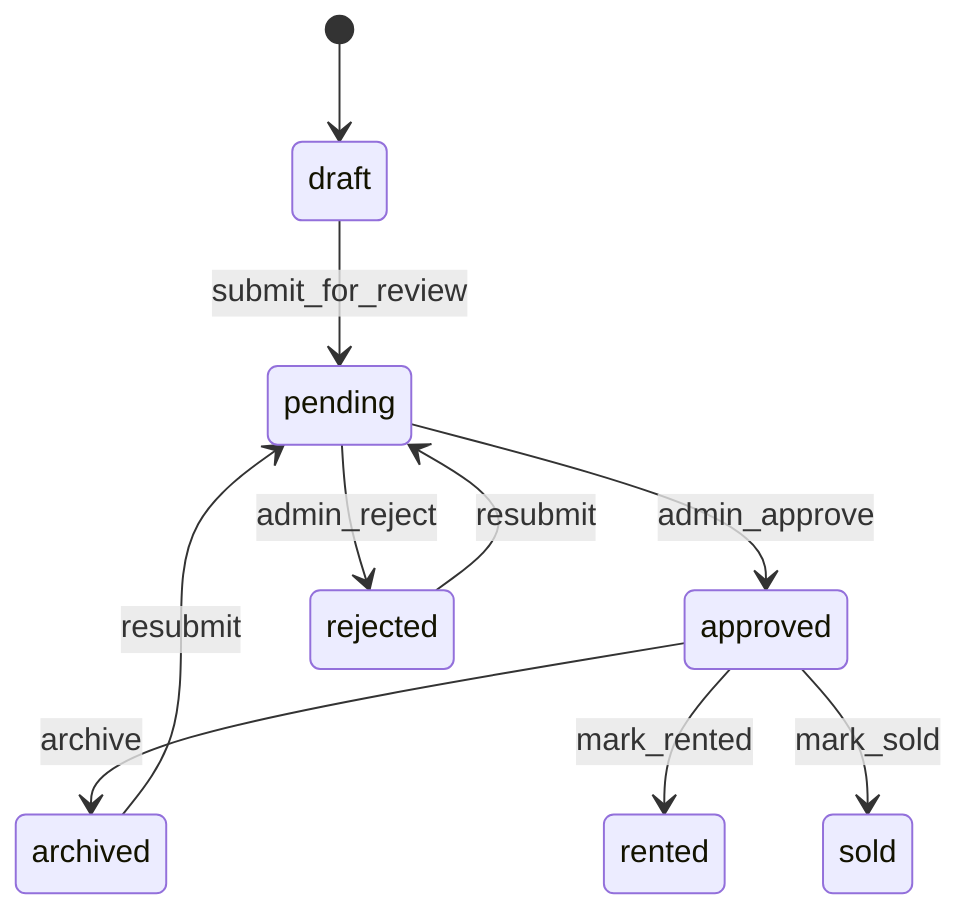
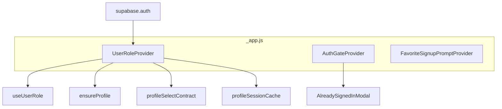
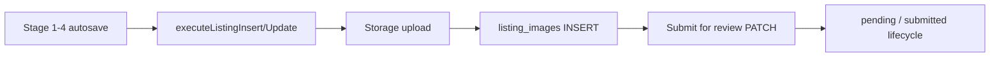

# BelizeListings — Platform Architecture Reference

**Audience:** Lead engineer inheriting the platform.  
**Repo:** `belizelistings-frontend` (Next.js Pages Router + Supabase).  
**Last grounded in codebase:** June 2026 (`PROJECT_TREE.md` dated 2026-06-23).

This document reflects **what is in the repository and referenced SQL scripts**, not aspirational product decks. When production Supabase diverges from migrations, treat **runtime PostgREST errors and tiered fallbacks** as signals of drift.

---

## 1. Executive Summary

BelizeListings is a **Next.js 16** frontend for a Belize-focused real-estate inventory platform. The browser talks **directly to Supabase** (Auth, Postgres, Storage, Realtime) via `@supabase/supabase-js`. There is no separate application backend beyond a **small set of Next.js API routes** (active-listing cap enforcement, admin user creation, username checks, profile repair).

**Core inventory** lives in `public.listings`; **gallery media** in `public.listing_images` + Storage bucket `listing-images`; **identity** in `public.profiles` (1:1 with `auth.users` via trigger). **Lifecycle** is expressed through overlapping fields (`status`, `lifecycle_status`, `moderation_status`) normalized in `src/utils/canonicalListing.js` and `src/constants/operationalModel.js`.

**Dashboard surfaces** are role-adaptive: `user`, `agent`, `broker`, `admin` (plus operator tooling inside admin). **Public discovery** is map-first home (`/`), search (`/search`), district routes, and listing detail (`/listing/[id]`).

**Maturity:** Feature-rich UI and careful **schema-compat layers** (select/write contracts, tiered degradation) indicate active stabilization toward beta. Production readiness is **blocked by schema/RLS drift**, incomplete brokerage scope, placeholder surfaces (`/agents`), and TEMPORARY QA listing caps.

---

## 2. Product Vision

From `docs/BELIZELISTINGS_SYSTEM_RULES.md` and design DNA:

- **Calm tropical intelligence** — premium Belize editorial, sea-glass palette, readability over noise.
- **Canonical inventory core** — `listings` is the source of truth; `amenities[]` canonical; `features` legacy text.
- **Moderation-gated public visibility** — nothing is broadly public until approved/published lifecycle.
- **District intelligence** — map, region slugs, explore routes (`geographyLayer`, `belizeMapRegions`).
- **Directional** (not committed order): operator inventory intelligence, messaging/scheduling, moderation maturity, analytics, developer tooling, broader “real estate intelligence ecosystem.”

---

## 3. Current Platform Status

| Area | Status |
|------|--------|
| Public browse (map, search, listing detail) | **Working** — `fetchApprovedListingsWithImages`, client filter via `isPubliclyVisibleListing` |
| User dashboard (`/dashboard/user`) | **Recent, substantial** — Zustand store, tabbed shell, cap UX |
| Create workspace (`/dashboard/create`) | **Working** — 5-stage flow, autosave, media upload, submit-for-review |
| Admin moderation (`/admin`) | **Working** — pending/all/users/operator panels |
| Agent dashboard | **Working** — listings + inquiries tab when table exists |
| Broker dashboard | **Partial** — `brokerage_id` not on profiles in migrations; team scope empty |
| `/agents` marketing page | **Placeholder** — signup CTA only |
| Inquiries (user dashboard metric) | **Flag-gated off** by default (`BL_ENABLE_INQUIRIES`) |
| Official Supabase migrations | **5 files** — profiles trigger/RLS, admin RLS, listings index |
| Root `supabase-*.sql` scripts | **15+ additive scripts** — many columns **not** in `supabase/migrations/` |
| README | **Generic create-next-app stub** — not platform-specific |
| Tests | **Jest** — contracts, canonical listing, persistence, compat layers |

**Stack:** React 19, Next 16 (webpack dev), Zustand 5, Framer Motion, Lucide, ESLint 9.

---

## 4. User Roles

Defined in `src/constants/dashboardRoles.js` and resolved from `profiles.role` via `useUserRole` → `resolveTierFromProfile` (`operationalModel.js`).

| `profiles.role` (examples) | Dashboard route | `PLATFORM_TIER` |
|----------------------------|-----------------|-----------------|
| `user` (default) | `/dashboard/user` | `public` |
| `agent` | `/dashboard/agent` | `agent_free` |
| `agent_pro`, `verified_agent` | `/dashboard/agent` | `agent_pro` |
| `broker`, `brokerage`, `property_manager` | `/dashboard/broker` | `brokerage` |
| `admin` | `/admin` | `admin` |

**Routing:** `src/pages/dashboard/index.jsx` redirects by role after auth.

**Capabilities** (`useRoleAccess.js`): public users can create listings; agents/admin can access professional dashboards; only admin can moderate. Trust badges (`trustModel.js`) vary by tier but **verification columns are not on profiles in migrations** — `resolveProfileVerification` is largely placeholder.

**Listing caps** (`operationalModel.js`):

- `AGENT_FREE_ACTIVE_LISTING_CAP = 5`
- `PUBLIC_ACTIVE_LISTING_CAP = 10` — annotated **TEMPORARY QA — revert after draft stabilization testing**
- Higher tiers: no cap (`resolveActiveListingCapForTier` returns `null`)

---

## 5. Listing Lifecycle

Canonical constants in `LISTING_LIFECYCLE` (`operationalModel.js`):

```text
draft → pending (pending_review) → approved (published) → rented | sold | archived | rejected | expired
```

**DB reality:** Legacy `status` still drives RLS public read (`status = 'approved'` in `supabase-listings-migrate-to-user-id.sql`). Newer code **dual-writes** `lifecycle_status` and `moderation_status` via `listingWriteContract.js` with tiered fallbacks when columns are missing.

**Resolution order** (`getLifecycleStatus` in `canonicalListing.js`): archived/rejected win from any authoritative field; then pending queue; then `lifecycle_status`; then `status`.

**User dashboard buckets** (`userDashboardListingTruth.js`):

| Bucket | Consumes cap? | Public? |
|--------|---------------|---------|
| Active (approved) | Yes | Yes |
| Pending | No | No |
| Draft | No | No |
| Archived | No | No |



---

## 6. Dashboard Architecture

**Shell:** `DashboardShell` + `RoleBadge` (`src/components/dashboard/`). Role metadata in `DASHBOARD_ROLE_META`.

| Surface | Path | Primary components |
|---------|------|-------------------|
| User Control Center | `/dashboard/user?tab=` | `UserDashboardMetrics`, `UserMyListingsPanel`, `UserPendingListingsPanel`, `UserArchivedListingsPanel`, `UserUpgradePathModal` |
| Agent | `/dashboard/agent` | `PropertiesPanel`, `VacancyPanel`, `AgentInquiryList`, operational strips |
| Broker | `/dashboard/broker` | Team listing intel (scope limited) |
| Admin | `/admin` | `PendingListingsPanel`, `AllListingsPanel`, `ManageUsersPanel`, `OperatorListingsPanel` |
| Create workspace | `/dashboard/create` | 5-stage `create.jsx` + `CreateWorkspace.module.css` |

**Tab routing:** User dashboard uses shallow `router.replace` with `?tab=` — does **not** remount `UserRoleProvider` or refetch profile (`useUserRole` comment).

**Greeting:** `dashboardGreeting.js` — username-first from `profiles.username`.

---

## 7. Authentication Architecture



**Canonical login path:** `/login` (`authRoutes.js`). `/signin` and `/signup` redirect to `/login` (with query preservation).

**Single auth subscription:** `UserRoleProvider` in `_app.js` — **do not** add duplicate `onAuthStateChange` listeners. `useAuth` is a thin wrapper over `useUserRole`.

**Profile creation:**

1. **DB trigger** `handle_new_user` on `auth.users` INSERT (`supabase/migrations/20260512120000_*`, hardened in `20260512140000_*`).
2. **Client repair** `ensureProfile.js` — username enrichment, backoff read, INSERT repair with tiered return select.

**AuthGateProvider:** Centralizes “already signed in” modal when CTAs target login; `logoutToHome` vs `signOutAndSwitchAccount`.

**Password flows:** `/forgot-password`, `/reset-password`.

**Server admin APIs:** Require bearer JWT + `profiles.role = admin`; mutations use `SUPABASE_SERVICE_ROLE_KEY` where needed (`create-user.js`).

---

## 8. Supabase Architecture

**Client:** `src/lib/supabaseClient.js` — `createClient(NEXT_PUBLIC_SUPABASE_URL, NEXT_PUBLIC_SUPABASE_ANON_KEY)`.

**Env vars:**

| Variable | Use |
|----------|-----|
| `NEXT_PUBLIC_SUPABASE_URL` | Browser + API routes |
| `NEXT_PUBLIC_SUPABASE_ANON_KEY` | Browser + user-scoped API |
| `SUPABASE_SERVICE_ROLE_KEY` | Admin API routes only |
| `NEXT_PUBLIC_BL_ENABLE_INQUIRIES` | User dashboard inquiries metric/realtime |
| `NEXT_PUBLIC_BL_SKIP_USER_DASHBOARD_FAVORITES_COUNT` | Skip favorites count probe |

**Image CDN:** `next.config.js` `remotePatterns` for `*.supabase.co/storage/v1/object/public/**` (note: **three hostname variants** listed — verify which is live).

**Compat layer:** `supabaseCompat.js` — `isMissingColumnError`, `isMissingRelationshipError`, `isTerminalListingQueryError`, transient network detection.

**Realtime:** User dashboard store, favorites (`useFavorites`), admin panels (profiles/listings revisions), notification center.

**No Supabase CLI config** in tree snapshot — migrations are files to apply via `supabase db push` or SQL editor.

---

## 9. Database Tables

**Confirmed in migrations + SQL scripts (not all in `supabase/migrations/`):**

| Table | Purpose |
|-------|---------|
| `auth.users` | Supabase Auth |
| `public.profiles` | Identity: `id`, `email`, `role`, `username`, timestamps |
| `public.listings` | Canonical inventory |
| `public.listing_images` | Gallery rows (`listing_id`, `image_url`, `position`) |
| `public.favorites` | `user_id`, `listing_id` unique pair |
| `public.listing_inquiries` | Lead capture (`supabase-listing-inquiries.sql`) |
| `public.agent_requests` | Agent onboarding requests (`supabase-agent-system.sql`) |
| `public.properties` | Internal property records (`supabase-property-unit-management.sql`) |
| `public.units` | Units under properties |
| `public.favorites` | Saved listings |

**`listings` column surface** (allowlist in `listingsSchemaAllowlist.js` + canonical alignment script):

- Core: `title`, `price`, `currency`, `property_type`, `district`, `region_slug`, `subregion_slug`, `listing_type`, `beds`, `baths`, `garage`, `square_feet`, `description`, `amenities`, `features`
- Ownership: `user_id`, `listed_by`, `managed_by`, attribution UUIDs
- Lifecycle: `status`, `lifecycle_status`, `moderation_status`, `review_status`, timestamps (`published_at`, `archived_at`, …)
- Operator: `unit_id` (preserved); **`property_id` exists in SQL script but app rules forbid treating it as canonical** (`BELIZELISTINGS_SYSTEM_RULES.md`)
- Enrichment: `market_type`, `category`, verification fields, vacancy fields (`occupied_at`, `vacancy_status`, …)

**Optional / not in migrations:** `view_count`, `favorite_count`, `inquiry_count` on `listings` (referenced in `listingDashboardSelectContract.js` as intel columns — **stripped in production selects**).

**`profiles` forbidden selects** (`profileSelectContract.js`): `verification_status`, `full_name`, `display_name`, `tier`, `brokerage_id`, `select(*)`.

---

## 10. Storage Architecture

**Bucket:** `listing-images` (public URLs).

**Upload path pattern:** `{userId}/{timestamp}-{position}-{safeFileName}` (`createListingUploads.js`).

**Flow:**

1. `supabase.storage.from("listing-images").upload(...)`
2. `getPublicUrl(filePath)`
3. INSERT into `listing_images` with `listing_id`, `image_url`, `position`

**Next/Image:** Qualities `[75, 82]` synced with `imageQuality.js`. Remote patterns allow Supabase storage host.

**Deletion:** Draft discard and permanent delete paths remove `listing_images` rows (`listingPersistence.js`, `ownershipAttribution.js`). Storage object cleanup may be incomplete — verify bucket policies and orphan strategy.

**Public assets:** `public/listings/`, `public/maps/`, `public/brand/mayflower-atmosphere.png`.

---

## 11. RLS Policies & Security Model

**Profiles** (`20260512140000_*`):

- Authenticated: SELECT/INSERT/UPDATE own row (`auth.uid() = id`)
- Admin: SELECT/UPDATE all via `is_admin()` (`20260512180000_*`, fix `20260512190000_*`)

**Listings** (`supabase-listings-migrate-to-user-id.sql` reference):

- Owner CRUD: `auth.uid() = user_id`
- Admin: full access via `profiles.role = 'admin'` subquery
- Public read: `status = 'approved'` for `anon, authenticated`

**Gap:** Public policy does **not** mention `lifecycle_status`/`moderation_status` — client filters approved rows, but **RLS may expose non-approved rows if `status` is stale**.

**Favorites** (`supabase-favorites-rls.sql`): own-row SELECT/INSERT/DELETE; unique `(user_id, listing_id)`.

**Listing inquiries:** Agent SELECT/UPDATE own; sender SELECT own; INSERT only for approved listings (`supabase-listing-inquiries.sql`).

**API route security:**

- `enforce-active-cap.js` — bearer JWT, never trusts body `user_id`
- `create-user.js` — admin JWT + service role for `auth.admin.createUser`

**Service role:** Must never ship to browser. Missing service role → admin APIs return 500.

---

## 12. State Management Architecture (Zustand)

**Single store:** `src/stores/useUserDashboardStore.js`.

**Scope:** `/dashboard/user` metrics and My Listings grid only — not global app state.

**State:**

- Listing counts (active, pending, archived, draft), favorites count, inquiries count
- `myListingsRows`, cap/remaining, loading/error/terminal flags
- Realtime debounce (480ms), coalesced inflight guards

**Lifecycle:**

- `init(userId, role)` on user dashboard mount
- `destroy()` on unmount / role change
- `stagePostCreateMyListingRow` — optimistic row after create/submit
- `invalidate()` / `loadMyListings` / `loadMetrics`

**Realtime mask:** Bit flags for favorites + inquiries subscriptions; auto-disabled on terminal PostgREST errors.

**Everything else:** React local state, context providers (`UserRoleProvider`, `AuthGateProvider`, `ToastProvider`, `FavoriteSignupPromptProvider`), module-level caches (`approvedListingsCache.js`, `profileSessionCache.js`).

---

## 13. Create Listing Workflow

**Page:** `src/pages/dashboard/create.jsx` (~2000 lines).

**Stages** (`WORK_STAGES`):

1. Property basics  
2. Property details  
3. Media studio  
4. Preview & health  
5. Submit for review  

**Navigation rules** (system rules): Back / Continue / Save draft — stage pills informational only.

**Persistence:**

- `listingWriteContract.js` — `executeListingInsert`, `executeListingUpdate`, `withListingPersistLock`
- `listingPersistence.js` — payload builders, `safeInsertListing`, `submitDraftListingForReview`, `validateListingDraftContract`
- `listingPayloadSanitize.js` — strips to `ALLOWED_LISTINGS_COLUMNS`
- `draftListingInsertContract.js` — omits draft-only fields on INSERT

**Cap enforcement before new draft:**

1. Client: `getUserActiveListingCount`
2. Server: `POST /api/listings/enforce-active-cap` with bearer token → 429 at cap

**Media:** `uploadListingImageFiles`, `persistListingImageOrder`.

**Preview:** Dynamic import `HomePropertyCard` — must match listing card DNA (see `BELIZELISTINGS_LISTING_CARD_DNA.md`).

**Post-submit:** `stagePostCreateMyListingRow` + navigate to `/dashboard/user?tab=my-listings` + metrics bus invalidation.

**Land listings:** `beds`/`baths`/`garage` null — not zero (`system rules`).



---

## 14. Moderation Workflow

**Admin hub:** `src/pages/admin/index.jsx` — tabs: pending, all listings, users, operator listings.

**Pending queue:** `PendingListingsPanel.jsx` — loads via `select(*)` with OR on pending statuses; falls back to `status = pending` if lifecycle columns missing.

**Actions:** Approve/reject/archive via `listingWriteContract` moderation tiers (`MODERATION_APPROVE_STATUS_TIERS`, etc.) and `ownershipAttribution.applyListingLifecycleAction`.

**Reject UX:** `RejectListingModal` — `rejection_reason` when column exists.

**Side effects on moderation:**

- `invalidateApprovedListingsCache()` on approve/archive
- `clearAllFavoritesForListing` on reject/archive paths
- `useUserDashboardStore.invalidate` for owner UX

**Operator panel:** `OperatorListingsPanel.jsx` — inline editor, filters, lifecycle actions (admin-scoped).

**Notification center (agents):** Summarizes pending/draft counts; inquiry items when `listing_inquiries` exists.

**Bulk admin actions:** Present in admin page (bulk approve patterns) — verify before production use.

---

## 15. Public Search & Discovery

| Route | Mechanism |
|-------|-----------|
| `/` | Map-first home — `BelizeMap`, featured carousel, `fetchApprovedListingsWithImages`, `filterListings` |
| `/search` | Query `q`, `district`, `market` filters on approved inventory |
| `/listings/district/[district]` | District-scoped browse |
| `/listing/[id]` | Detail — `fetchListingByIdWithImages`; admin bypass for preview |

**Approved fetch:** `listingQueries.fetchApprovedListingsWithImages` — OR on `status`/`moderation_status` approved; then `filterPublicInventory`.

**Caching:** `approvedListingsCache.js` — deduped in-memory cache for home/alerts.

**Alerts:** `useAlerts.js` — compares saved searches to listing set; localStorage `belize_alert_last_seen`.

**Filters:** `FilterBar`, `HomeAdvancedFiltersModal`, `utils/filterListings.js` — land bypasses residential assumptions.

---

## 16. Favorites & Notifications

**Favorites:**

- Table + RLS in `supabase-favorites-rls.sql`
- `lib/favorites.js`, `hooks/useFavorites.js` — realtime sync channel per user
- `/favorites` page
- Guest prompt: `FavoriteSignupPromptProvider` + `GatedAccountCtaLink`

**Notifications:**

- `NotificationCenter.jsx` in `SiteNav` — agent inquiries + listing state summaries; admin pending count
- Not a unified notification table — **derived from listings + inquiries queries**

**User dashboard inquiries metric:** Disabled unless `NEXT_PUBLIC_BL_ENABLE_INQUIRIES=1` (`featureFlags.js`). Copy: `inquiriesComingSoon` in `dashboardUserConfig.js`.

**Listing detail contact:** `ContactAgentModal` — WhatsApp/mailto/deep links; `ListingMessageModal` / `submitListingInquiry` for structured inquiries when implemented on listing page.

---

## 17. Agent & Brokerage Systems

**Agent dashboard** (`agent.jsx`):

- Listings via `fetchUserOwnedListingsForDashboard`
- Cap: `AGENT_FREE_ACTIVE_LISTING_CAP` (5) for free tier
- Inquiries tab: `fetchInquiriesForAgent` when table exists
- Properties/vacancy panels — tied to `properties`/`units` SQL (operator path)

**Agent onboarding:**

- `/agents` — **placeholder marketing** only
- `agent_requests` table in SQL — UI integration limited
- `UserUpgradePathModal` — agent/broker/developer paths; developer “opening soon”

**Broker dashboard** (`broker.jsx`):

- `fetchBrokerTeamAgentIds` via `brokerTeamScope.js` — expects `profiles.brokerage_id` (**not in migrations**)
- Code sets `bid = ""` — **team listings always empty** unless repaired manually

**Brokerage verification:** Copy in `USER_DASHBOARD_COPY.brokerVerificationNote` — process not automated in codebase.

---

## 18. Current Completed Features

- Map-first homepage with district map and featured inventory
- Public search and district routes
- Listing detail with gallery and contact modals
- Email/password auth, profile trigger, username rules, ensureProfile repair
- Role-based dashboard routing
- User dashboard (overview, my listings, pending, archived, favorites tab link)
- Create workspace (5 stages, autosave, media, preview, submit)
- Active listing cap (client + API) with tier resolution
- Admin moderation (pending, all, users, operator editor)
- Agent dashboard with inquiry inbox (when DB table present)
- Favorites with RLS and realtime
- Select/write contracts with automated tests
- Design system tokens, listing card DNA docs
- Saved search alerts (localStorage)
- API: enforce-active-cap, check-username, admin create-user, repair-missing-profiles

---

## 19. Current Incomplete Features

- **Broker team scope** — no `brokerage_id` on profiles in repo migrations; broker dashboard non-functional for teams
- **`/agents` page** — marketing placeholder, no onboarding workflow
- **Developer upgrade path** — “opening soon”
- **User dashboard inquiries** — flag off by default; metric shows “Coming soon”
- **Messages / appointments placeholders** — `USER_DASHBOARD_PLACEHOLDERS`
- **Listing intel columns** — `view_count`, `favorite_count`, `inquiry_count` not migrated; UI shows fallbacks in `UserListingRowIntel`
- **Trust/verification** — `trustModel` capabilities without DB verification columns on profiles
- **Structured inquiry on all contact surfaces** — ContactAgentModal favors external channels
- **README / ops docs** — generic README; this document is the first comprehensive arch reference
- **Storage orphan cleanup** — not evidenced in delete paths
- **property_id on listings** — in SQL script; explicitly excluded from product rules

---

## 20. Known Technical Debt

1. **Schema drift** — 15+ root `supabase-*.sql` vs 5 migrations; production may lack `lifecycle_status`, region slugs, intel columns.
2. **Dual lifecycle model** — `status` vs `lifecycle_status`/`moderation_status`; extensive fallback tiers in write/select contracts.
3. **Inconsistent SELECT discipline** — moderation panels use `select(*)`; dashboards use strict contracts.
4. **PUBLIC_ACTIVE_LISTING_CAP = 10** — marked TEMPORARY QA in `operationalModel.js`.
5. **Three Supabase hostnames** in `next.config.js` — likely typo history; consolidate.
6. **`react-router-dom` in package.json** — unused with Pages Router (dead dependency?).
7. **Single Zustand store** — other dashboards use ad hoc fetches; no shared inventory store.
8. **Approved listings cache** — module singleton; stale until `invalidateApprovedListingsCache`.
9. **RLS public read** — `status = 'approved'` only; misaligned with canonical lifecycle normalization.
10. **Admin profile count** — dev warning when count=1 suggests RLS not applied (`admin/index.jsx`).
11. **Tests not in CI** — `npm test` exists; no workflow evidenced in tree.
12. **Generic README** — onboarding hazard for new engineers.

---

## 21. Beta Readiness Assessment

| Criterion | Ready? | Notes |
|-----------|--------|-------|
| Core browse + detail | **Yes** | With approved inventory in DB |
| User signup + listing create | **Yes** | Cap at 10 (QA) may confuse beta users |
| Moderation loop | **Mostly** | Admin must exist; RLS must allow admin reads |
| Agent workflows | **Partial** | Inquiries need table + flag |
| Broker workflows | **No** | Team scope broken |
| Schema consistency | **No** | Apply canonical alignment + step6 scripts |
| Observability | **Weak** | Console warnings, grouped mutation diagnostics |
| Documentation | **Improving** | This doc + system rules |

**Beta recommendation:** Acceptable for **closed beta** with public users + admin moderation after **one consolidated DB apply** (migrations + canonical alignment + favorites RLS + inquiries if needed). Not ready for brokerages or developer accounts.

---

## 22. Production Readiness Assessment

**Blockers:**

- Consolidate and apply all schema scripts; eliminate tiered fallback dependence
- Revert or productize `PUBLIC_ACTIVE_LISTING_CAP` (10 is QA)
- Fix broker `brokerage_id` or disable broker dashboard publicly
- Harden RLS public read to match `isPubliclyVisibleListing`
- Service role + admin RLS verified in production
- Storage policies for `listing-images` bucket
- CI: lint + test on PR
- Environment parity checklist (Supabase URL, image host, flags)
- Rate limiting on API routes (cap enforcement, create-user)
- Error monitoring (Sentry/etc.) — not in repo

**Strengths:** Contract tests, sanitization allowlist, auth centralization, calm UX patterns.

---

## 23. Operational Runbooks Needed

1. **New Supabase project bootstrap** — order: profiles trigger → listings RLS → canonical alignment → favorites → inquiries → storage bucket + policies → admin RLS migrations → index migration.
2. **Schema change** — update `listingsSchemaAllowlist.js`, `listingWriteContract`, `listingDashboardSelectContract`, migration file, PostgREST schema reload.
3. **Promote user to agent/admin** — `profiles.role` UPDATE (admin RLS); verify dashboard redirect.
4. **Stuck pending listing** — inspect `status`, `lifecycle_status`, `moderation_status`; use admin approve tiers or manual SQL.
5. **Profile missing after signup** — verify `handle_new_user` trigger; run `repair-missing-profiles` API; check `ensureProfile` terminal sessionStorage keys.
6. **Images not showing** — `listing_images` rows, bucket public URL, `next.config.js` remotePatterns host.
7. **Admin sees 1 user** — apply `20260512190000_profiles_admin_rls_fix.sql`.
8. **Cap false positives** — `getUserActiveListingCount` logic; archived vs approved normalization.
9. **Feature flags** — `NEXT_PUBLIC_BL_ENABLE_INQUIRIES`, `NEXT_PUBLIC_BL_SKIP_USER_DASHBOARD_FAVORITES_COUNT`.
10. **Deployment** — `npm run build`; Vercel-compatible; env vars documented.

---

## 24. Disaster Recovery & Succession Planning

**Critical assets:**

- Supabase project (Auth users, DB, Storage) — **primary state**; frontend is disposable from git.
- `SUPABASE_SERVICE_ROLE_KEY` — secure backup; required for admin APIs and user creation.
- SQL scripts in repo — **source of intended schema**; verify against live DB regularly.

**Recovery steps:**

1. Restore Supabase from provider backup / PITR.
2. Redeploy frontend from `main` with correct env vars.
3. Re-run migration verification queries (`supabase/verification/`).
4. Invalidate CDN/image cache if bucket restored from backup.

**Succession:**

- Read order: this doc → `BELIZELISTINGS_SYSTEM_RULES.md` → `listingWriteContract.js` → `profileSelectContract.js` → `useUserRole.js`.
- **Do not** add inline `.from("listings").select(...)` in dashboard paths — use contracts.
- **Do not** add duplicate auth listeners.
- Owner: confirm production Supabase project ID matches `next.config.js` image host.

**Access matrix to document externally:** Supabase dashboard, Vercel/hosting, domain/DNS, email auth templates.

---

## 25. Recommended Future Roadmap

**Phase A — Stabilize (0–3 months)**

- Single migration consolidating root SQL scripts into `supabase/migrations/`
- Align RLS public read with canonical lifecycle
- Revert QA cap; document tier limits in product
- Remove `select(*)` from moderation panels; unify on contracts
- CI pipeline (lint, jest)
- Brokerage: add `brokerage_id` + team RLS or hide broker dashboard

**Phase B — Beta hardening (3–6 months)**

- Enable inquiries flag by default after table + UX audit
- Real agent onboarding (`agent_requests` → workflow)
- Listing intel columns + analytics pipeline (or remove UI placeholders)
- Storage lifecycle (delete objects on listing delete)
- Observability and mutation telemetry export

**Phase C — Platform depth (6–12 months)**

- Operator property/unit management UI (tables exist in SQL)
- District intelligence and editorial content
- Verification/trust badges backed by DB
- Messaging inbox (replace placeholders)
- Scheduling / viewing bookings (`ListingViewingBookingModal` exists — wire to backend)
- Mobile polish (`mobileFoundation.js` hints)

---

## Appendix A — Key File Index

| Concern | Path |
|---------|------|
| App shell | `src/pages/_app.js` |
| Roles / tiers / caps | `src/constants/operationalModel.js` |
| User dashboard copy | `src/constants/dashboardUserConfig.js` |
| Listing SELECT contract | `src/lib/listingDashboardSelectContract.js` |
| Listing WRITE contract | `src/lib/listingWriteContract.js` |
| Profile SELECT contract | `src/lib/profileSelectContract.js` |
| Lifecycle normalization | `src/utils/canonicalListing.js` |
| Auth + profile hydrate | `src/hooks/useUserRole.js`, `src/lib/profileSessionCache.js` |
| Auth gate UX | `src/components/auth/AuthGateProvider.jsx` |
| User dashboard store | `src/stores/useUserDashboardStore.js` |
| Create flow | `src/pages/dashboard/create.jsx` |
| Approved inventory fetch | `src/lib/listingQueries.js` |
| Allowlist | `src/constants/listingsSchemaAllowlist.js` |
| Migrations | `supabase/migrations/` |
| Reference SQL | `supabase-*.sql` (repo root) |

## Appendix B — API Routes

| Route | Method | Purpose |
|-------|--------|---------|
| `/api/listings/enforce-active-cap` | POST | JWT-scoped active listing cap check |
| `/api/auth/check-username` | * | Username availability |
| `/api/admin/create-user` | POST | Admin creates auth user + profile |
| `/api/admin/repair-missing-profiles` | * | Profile repair batch |

---

*When production behavior disagrees with this document, trust PostgREST errors, Supabase logs, and the contract modules — then update this file.*
