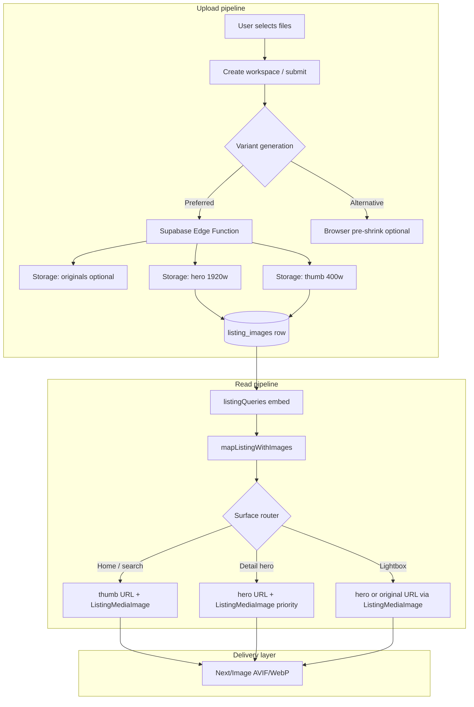

# BelizeListings — Image Performance Optimization

**Audience:** Engineering lead, beta stabilization  
**Repo:** `belizelistings-frontend`  
**Grounded in codebase:** June 2026  
**Related:** `docs/BELIZELISTINGS_ARCHITECTURE.md` §10 Storage, `src/constants/imageQuality.js`

---

## Executive summary

BelizeListings already has a **solid display-layer foundation**: canonical `ListingMediaImage` (Next/Image + AVIF/WebP + LQIP shimmer), tiered quality constants (`75` / `82`), and responsive `sizes` on cards and detail hero. The main gap is **upstream**: uploads store **one full-resolution original** per photo in Supabase Storage, and the **lightbox bypasses Next/Image** via native ``.

**Recommendation:** Prefer **server-side variants at upload time** (Supabase Edge Function + Storage) as the long-term source of truth, with **Supabase Storage Image Transformations** as an optional read-path accelerator—not browser-side compression as the primary strategy. Keep Next/Image as the **delivery optimizer** for all public surfaces.

**Expected impact (after Phase 2):**

| Surface | Today (rough) | Target | Improvement |
|---------|---------------|--------|-------------|
| Homepage card (1 photo) | 800 KB–3 MB original → ~40–120 KB via Next proxy | ~25–80 KB thumb variant + Next | **~30–50% fewer bytes**, faster TTFB on cold CDN |
| Search list thumb | Same as cards | Thumb URL directly | **Predictable** ~400 px cap |
| Listing detail hero | Next resizes original (CPU + double hop) | Pre-baked 1920 px hero | **~40–60% faster LCP** on large uploads |
| Lightbox | **Full original** (often 4–8 MB) | Hero or `original` on demand | **~70–90% fewer bytes** |
| Create upload (mobile) | Full file upload | Resized hero + thumb server-side | **~50–80% faster uploads** |

Qualitative: calmer homepage scroll, fewer layout jank events on map-first load, lower Supabase egress bills, more predictable beta QA on slow connections.

---

## Current state (what exists today)

### Storage & schema

| Piece | Status |
|-------|--------|
| Bucket | `listing-images` (public) |
| Object path | `{userId}/{timestamp}-{position}-{safeFileName}` (`createListingUploads.js`) |
| DB table | `listing_images(id, listing_id, image_url, position)` — **single URL per row** |
| Variants | **None** — no thumb/hero/original columns or path convention |
| Upload | Raw `File` → Storage → `getPublicUrl()` → INSERT row |
| Ordering | `position` column; `persistListingImageOrder()` updates on reorder |

Upload entry points:

- `src/lib/createListingUploads.js` — canonical helper used by create workspace draft save
- `src/pages/dashboard/create.jsx` — duplicate inline upload loops on submit paths (same bucket/path pattern)

### Data fetching

| Query | Images loaded |
|-------|---------------|
| `fetchApprovedListingsWithImages()` | **All** `listing_images (*)` embedded per listing — used by homepage, map, alerts cache |
| `fetchListingByIdWithImages()` | All images for one listing, sorted by `position` |
| Dashboard fetches | Tiered embed `listing_images(id,image_url,position)` with fallback direct query |

Homepage cache (`approvedListingsCache.js`) deduplicates the **API** call but still returns full image URL arrays per listing in JSON.

### Display components

```
resolveListingImageUrl()          ← src/utils/listingImage.js (URL normalize, blob/data passthrough)
        │
        ▼
ListingMediaImage                 ← Next/Image + shimmer + blurDataURL + lazy (default)
        │
        ├── HomePropertyCard      ← card tier (82), sizes cap ~400px, carousel = 1 mounted image
        ├── ListingCard           ← search/list thumb (82), sizes ~112px
        ├── listing/[id].js     ← hero (82), thumb rail (75), lightbox rail (75)
        └── ListingImage          ← editorial bounded flex helper
        │
ListingMediaIntrinsic           ← native , loading="eager" — **full original URL**
```

### Next.js image config (`next.config.js`)

- Formats: AVIF, WebP
- Qualities: `[75, 82]` — synced with `imageQuality.js`
- `remotePatterns`: three Supabase hostname variants → `/storage/v1/object/public/**`
- **No** custom `deviceSizes` / `imageSizes` / `minimumCacheTTL`
- **No** Supabase `/storage/v1/render/image/...` transform patterns

### Quality policy (`src/constants/imageQuality.js`)

| Constant | Value | Used for |
|----------|-------|----------|
| `IMAGE_QUALITY_THUMB` | 75 | Detail thumb rail, lightbox rail |
| `IMAGE_QUALITY_CARD` | 82 | Homepage cards, search cards, default media |
| `IMAGE_QUALITY_HERO` | 82 | Detail main stage |
| `IMAGE_QUALITY_EDITORIAL` | 82 | `ListingImage` helper |

Design intent (documented in file): two quant tiers; hero sharpness comes from **`sizes` width**, not a third quality tier.

### Skeletons / placeholders

- **Shimmer + generic SVG LQIP** on all `ListingMediaImage` instances (`listingMediaBlur.js`)
- Static fallback `/placeholder.jpg` when URL missing
- No per-listing dominant-color blur (acceptable for beta)

### Lazy loading

| Surface | Behavior |
|---------|----------|
| Cards / hero (index 0) | `loading="lazy"` unless `priority={true}` |
| Detail hero first photo | `priority={index === 0}` on first paint |
| Detail thumb row | Lazy via Next/Image default — **but all thumbs mount in DOM at once** |
| Lightbox | Opens on demand; **`ListingMediaIntrinsic` loads full original eagerly** |
| HomePropertyCard carousel | Only **active** slide image mounted (`key={imageUrl}`) — good |

### Known gaps vs requirements

| Requirement | Gap |
|-------------|-----|
| Upload variants (400 / 1920 / optional original) | Not implemented |
| Homepage/search thumbnails only | Next/Image resizes at runtime; API still ships all image URLs per listing |
| Listing detail hero | Next/Image helps, but source is still multi-MB original |
| Lazy gallery below fold | Thumb row is same column as hero (often above fold); lightbox is the main full-res risk |
| Preserve `listing_images` ordering | **Supported today** via `position` — any variant plan must keep one logical row per photo |

---

## Recommended architecture

### Principle: separate **asset identity** from **delivery URLs**

Keep **one row per photo** in `listing_images` for ordering and moderation UX. Store variant URLs either as **columns** or as **deterministic paths** derived from a base key.



### URL resolution layer (new module)

Add `src/utils/listingImageVariants.js` (name illustrative):

```js
// Pseudocode — single choke point for all surfaces
export function resolveListingImageForSurface(rowOrUrl, surface) {
  // surface: 'thumb' | 'hero' | 'original'
  // 1. If row has thumb_url / hero_url / image_url columns → pick column
  // 2. Else if Supabase transform enabled → build render URL from storage path
  // 3. Else fallback to image_url (today's behavior)
}
```

Wire through `normalizeListingImageEntry`, `ListingMediaImage`, and dashboard thumbs (`UserMyListingsPanel` uses raw `` today).

### Surface mapping

| Surface | Source URL | Next/Image `sizes` (keep existing) | Priority |
|---------|------------|-------------------------------------|----------|
| Homepage / map cards | **thumb** (400w) | `(max-width: 520px) 100vw, …, 400px` | First viewport row only |
| Search `ListingCard` | **thumb** | `(max-width: 640px) 28vw, 112px` | No |
| Detail hero | **hero** (1920w) | `(max-width: 520px) 100vw, …, min(960px, 52vw)` | First image only |
| Detail thumb rail | **thumb** | `(max-width: 900px) 18vw, 120px` | Lazy |
| Lightbox main | **hero** (upgrade to original only on zoom-gesture future) | `100vw` max 1920 | On open |
| Dashboard previews | **thumb** | fixed ~64–96px | Lazy |

### Preserve ordering workflow

No change to user-facing reorder UX:

1. `listing_images.position` remains canonical order (0 = cover).
2. Variant files share a **stable base id** (e.g. `{userId}/{imageId}/`) so reorder only updates `position`, not Storage keys.
3. `persistListingImageOrder()` continues to PATCH `position` only.
4. Delete flow removes **all variant objects** for that row (Edge Function or storage path convention).

---

## Supabase transform vs client-side compression

| Criterion | Supabase Storage transforms (`/render/image/…?width=&quality=`) | Pre-generated variants at upload (Edge Function / sharp) | Browser-side compression (canvas / browser-image-compression) |
|-----------|-------------------------------------------------------------------|----------------------------------------------------------|------------------------------------------------------------------|
| **Consistency** | Good — server rules | **Best** — fixed recipes | Poor — device-dependent |
| **Upload speed** | Still uploads full original first | Upload once after server resize, or upload original + async job | Faster upload if shrink before send |
| **Read latency** | Transform on first hit, then CDN cache | **Fastest** — static objects | N/A |
| **Cost** | Supabase Pro + transform metering | Storage ×3, minimal compute once | No storage savings unless variants stored |
| **Next/Image interaction** | Works if `remotePatterns` includes `/render/image/**` | Works with existing `/object/public/**` patterns | Same |
| **Offline / retry** | Simple — one URL column still works | Need job status for async variant build | Fragile on mobile tab kill |
| **Beta risk** | Bucket config + plan dependency | New Edge Function deploy | Low code risk, high quality variance |
| **Lightbox / original** | `?width=3840` or serve true original path | Explicit `original_url` column | Must still store original somewhere |

### Verdict

| Priority | Approach |
|----------|----------|
| **Primary (recommended)** | **Upload-time variants** via Supabase Edge Function (`sharp`): write `thumb.webp`, `hero.webp`, optional `original.jpg`; store URLs on `listing_images` (or path convention). |
| **Secondary (optional accelerator)** | Enable **Supabase Image Transformations** for legacy rows missing variant columns during migration. |
| **Avoid as primary** | **Browser-side compression** — acceptable only as optional UX hint (“optimizing photos…”) on slow networks, not as the source of truth. |

Next/Image remains valuable as a **final-mile** format negotiator (AVIF/WebP, DPR, cache) even when serving pre-sized URLs.

---

## Phased implementation plan

### Phase 1 — Display & config quick wins (1–2 days, low risk)

**Goal:** Improve delivery without schema changes.

1. **Replace `ListingMediaIntrinsic` lightbox path** with `ListingMediaImage` (`fill`, `mode="contain"`, hero `sizes`, `IMAGE_QUALITY_HERO`) so lightbox stops fetching multi-MB originals.
2. **Tune `next.config.js`**: `imageSizes: […, 400]`, `minimumCacheTTL: 86400` (or align with deploy cadence).
3. **Detail thumb rail**: render thumbs with `loading="lazy"` + consider `content-visibility: auto` on off-screen cells (CSS-only).
4. **Dashboard raw ``** in `UserMyListingsPanel` / `UserPendingListingsPanel` → `ListingMediaImage` thumb tier for consistency.
5. **Consolidate upload** in `create.jsx` to always call `uploadListingImageFiles()` (remove duplicate loops).
6. **Homepage fetch optimization (API, not bytes)**: optional query view `listing_cover_image` (first by `position`) for map shell — reduces JSON payload when listings have 10+ photos.

**Schema changes:** None.

### Phase 2 — Variant pipeline (3–5 days, medium risk)

**Goal:** Meet 400 / 1920 / optional original requirement.

1. **Migration** — extend `listing_images`:

   ```sql
   ALTER TABLE listing_images
     ADD COLUMN IF NOT EXISTS storage_path text,
     ADD COLUMN IF NOT EXISTS thumb_url text,
     ADD COLUMN IF NOT EXISTS hero_url text,
     ADD COLUMN IF NOT EXISTS original_url text,
     ADD COLUMN IF NOT EXISTS width int,
     ADD COLUMN IF NOT EXISTS height int,
     ADD COLUMN IF NOT EXISTS bytes_original bigint;
   ```

   Backfill: `storage_path` parsed from existing `image_url`; `hero_url` / `thumb_url` null until regenerated.

2. **Edge Function `generate-listing-image-variants`**
   - Trigger: Storage webhook on `listing-images` **or** invoked from upload API route after put.
   - Generate: thumb max 400px edge, hero max 1920px edge, WebP (or JPEG fallback), preserve EXIF orientation.
   - Update row with URLs; keep `image_url` = `hero_url` for backward compatibility during rollout.

3. **`listingImageVariants.js`** — surface resolver; feature flag `BL_IMAGE_VARIANTS` (`featureFlags.js`).

4. **Upload flow** — after Storage put, call Edge Function; show progress in Media Studio (`create.jsx` phases).

5. **Regeneration admin script** — one-off for legacy listings.

6. **Deletion** — update `deleteListingImageRow` + discard flows to remove all variant objects.

**Storage layout (recommended):**

```
listing-images/{userId}/{listingId}/{imageRowId}/original.jpg
listing-images/{userId}/{listingId}/{imageRowId}/hero.webp
listing-images/{userId}/{listingId}/{imageRowId}/thumb.webp
```

### Phase 3 — Polish & observability (2–3 days)

1. **Homepage query split** — `fetchApprovedListingsWithImages()` → cover-only for map; full gallery only on detail fetch.
2. **Optional Supabase transforms** for legacy URLs (flag-gated) during backfill window.
3. **Dominant-color LQIP** (optional) — store 8×8 base64 on row or derive from thumb.
4. **Metrics** — extend `dashboardMetricsTelemetry.js` or Vercel/Web Vitals: LCP on `/listing/[id]`, homepage image bytes, upload failure rate.
5. **Storage orphan cleanup** job (listed as gap in architecture doc).

---

## Performance impact estimates

### Qualitative

- **Perceived homepage speed:** High — map-first view loads dozens of cards; thumb URLs remove Next double-hop on cold cache.
- **Listing detail LCP:** High — hero is above-the-fold; pre-baked 1920w avoids resizing 6000×4000 originals.
- **Lightbox:** Very high — currently worst-case path (full original, eager).
- **Create flow:** Medium — upload time and mobile UX improve; moderation preview loads faster.
- **Server cost:** Slight Storage increase; **egress decreases** if variants are smaller and cached.

### Rough metrics (typical 4032×3024 phone photo, ~3.5 MB JPEG)

| Path | Est. transfer | Est. decode time (mid Android) |
|------|---------------|--------------------------------|
| Today card via Next (original src) | 60–150 KB WebP/AVIF | ~80 ms |
| Thumb variant 400w WebP | 20–45 KB | ~30 ms |
| Today hero via Next | 150–350 KB | ~120 ms |
| Hero variant 1920w WebP | 120–220 KB | ~90 ms |
| Today lightbox intrinsic | **3.5 MB** | **500 ms–1.5 s** |
| Lightbox via hero variant | 120–220 KB | ~90 ms |

**Homepage scenario:** 24 visible cards × ~100 KB savings ≈ **2.4 MB less** on first paint vs unoptimized originals hitting Next cold.

Numbers vary by photo content; treat as order-of-magnitude for planning.

---

## Schema & storage changes summary

| Change | Required when | Notes |
|--------|---------------|-------|
| `listing_images.thumb_url`, `hero_url`, `original_url` | Phase 2 | `image_url` can alias `hero_url` for compat |
| `listing_images.storage_path` | Phase 2 | Enables delete + transform |
| `listing_images.width`, `height`, `bytes_original` | Phase 2 optional | Useful for layout CLS guardrails |
| Storage path convention | Phase 2 | Per-row folder with variant filenames |
| Edge Function + service role | Phase 2 | Variant generation |
| `next.config.js` `remotePatterns` for `/render/image/**` | Optional | Only if using Supabase transforms |
| Cover-only DB view or RPC | Phase 1 optional / Phase 3 | Reduce homepage JSON |

**No change** to `position` ordering semantics or `listing_images` ↔ `listings` relationship.

---

## Risk & compatibility (beta bug-fix window)

| Risk | Mitigation |
|------|------------|
| Breaking existing `image_url`-only rows | Resolver fallback chain; backfill job; keep `image_url` populated |
| Duplicate upload logic in `create.jsx` | Phase 1 consolidation before Phase 2 |
| Three Supabase hostnames in `remotePatterns` | Confirm live project hostname; variants use same host |
| RLS on `listing_images` | Edge Function uses service role; public read unchanged |
| Tiered select fallbacks (`listingDashboardSelectContract`) | Add new columns to embed tiers gradually; unknown columns stripped by compat layer |
| `ListingMediaIntrinsic` behavior change | Phase 1 swap to `ListingMediaImage` — test lightbox aspect ratios |
| Feature flags | Gate variant resolver + Edge Function (`BL_IMAGE_VARIANTS`) |
| QA listing caps / draft stabilization | Phase 1 is safe; Phase 2 behind flag + staging bucket prefix |

**Recommended sequencing during beta:** Ship **Phase 1** immediately; start Phase 2 in staging with flag off in production until backfill completes.

---

## Quick wins (can ship in <30 minutes each)

No quick wins were implemented in this pass — below are the highest ROI items safe for beta:

| # | Change | File(s) | Effort |
|---|--------|---------|--------|
| 1 | Lightbox: use `ListingMediaImage` instead of `ListingMediaIntrinsic` | `listing/[id].js` | ~15 min |
| 2 | Add `imageSizes` including `400` + `minimumCacheTTL` | `next.config.js` | ~5 min |
| 3 | Dashboard thumbs → `ListingMediaImage` | `UserMyListingsPanel.jsx`, `UserPendingListingsPanel.jsx` | ~20 min |
| 4 | Deduplicate submit uploads to `uploadListingImageFiles()` | `create.jsx` | ~25 min |

After any code change: `npm run build` to verify Next/Image config.

---

## Appendix — file reference

| Concern | Location |
|---------|----------|
| Quality constants | `src/constants/imageQuality.js` |
| Next config | `next.config.js` |
| URL normalize | `src/utils/listingImage.js` |
| Canonical display | `src/components/listing/ListingMediaImage.jsx` |
| Lightbox full-res (gap) | `src/components/listing/ListingMediaIntrinsic.jsx` |
| Upload | `src/lib/createListingUploads.js`, `src/pages/dashboard/create.jsx` |
| Queries | `src/lib/listingQueries.js` |
| Homepage cache | `src/lib/approvedListingsCache.js` |
| Detail gallery | `src/pages/listing/[id].js` |
| Cards | `src/components/HomePropertyCard.jsx`, `src/components/ListingCard.jsx` |
| LQIP | `src/utils/listingMediaBlur.js` |

---

## Decision log

| Date | Decision |
|------|----------|
| 2026-06-23 | **Prefer upload-time Supabase Edge variants** over browser compression; keep Next/Image; Phase 1 display fixes before schema migration. |
